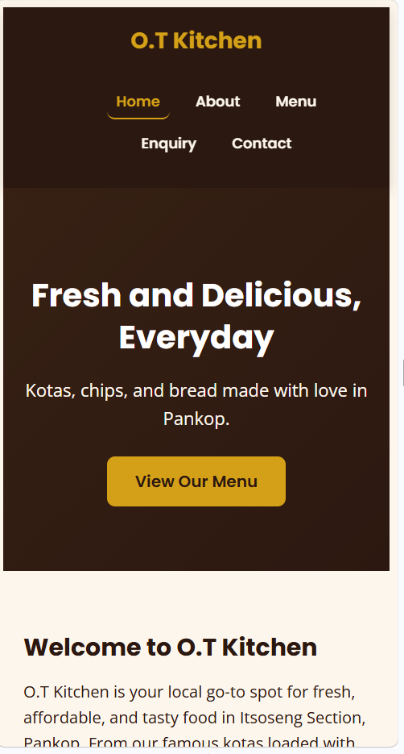
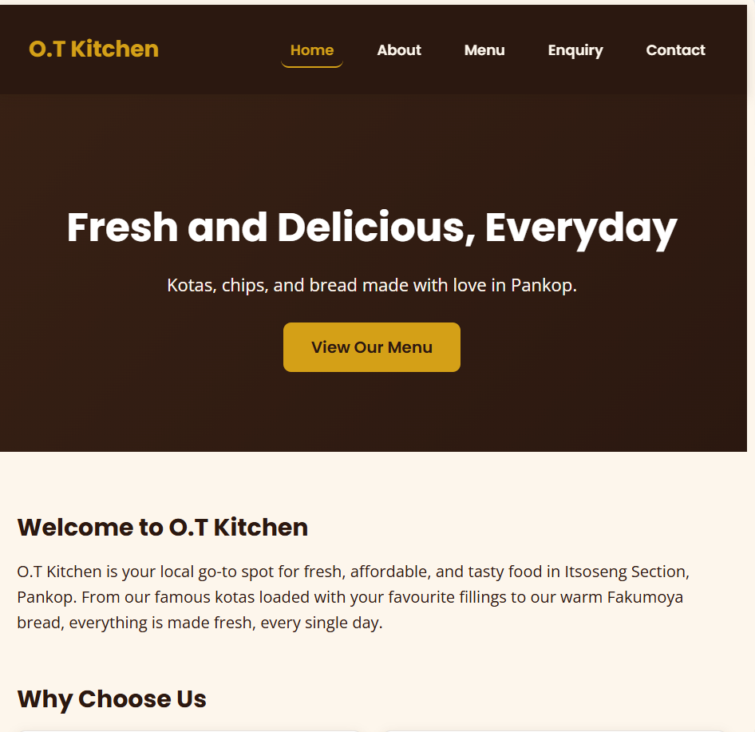

# O.T Kitchen Website

This is my project for WEDE5020 (Web Development) at Rosebank College (IIE).

Name: Masego Chabalala
Student Number: ST10523393
Module: WEDE5020

## What this project is about

O.T Kitchen is a small kota and fast-food kitchen in Itsoseng Section, Pankop. Right now they only post on WhatsApp status, but that disappears after 24 hours so people can't find them easily. I'm building them a website so people can see the menu, contact them and find their location anytime.

## Pages I made

- index.html - the home page, has a banner and intro and a button that goes to the menu
- about.html - talks about the business, their mission and vision
- menu.html - shows all the food and prices
- enquiry.html - a form where people can ask questions or make orders
- contact.html - has the location, phone number, hours and a map

## Design choices

Colours: black, gold and brown, because that's what O.T Kitchen already uses on their posters.

Fonts: Poppins for headings and Open Sans for the normal text.

I made it mobile-first because most people are going to look at it on their phone.

## What I used to build it

HTML5 & CSS3 

## Files in this project

- index.html
- about.html
- menu.html
- enquiry.html
- contact.html
- css folder with style.css
- images folder
- this README file

## How to open it

You don't need to install anything, just open index.html in your browser. Or if you're using VS Code, get the Live Server extension and right click index.html then click Open with Live Server.

## Where it will be hosted

Planning to put it on GitHub Pages since it's free, and later get a .co.za domain.

## Where I'm at

This is Part 1, just the proposal and basic structure. Part 2 is the CSS and making it responsive.

### Responsive Design Evidence

#### Mobile (375px) 

#### Tablet (768px) 

#### Desktop (1920px)

